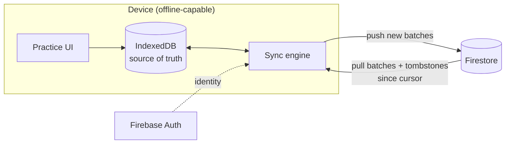
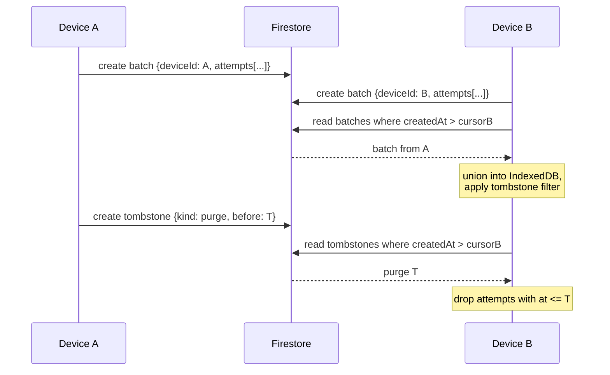

<!-- Calibration: Medium complexity | Single-maintainer project | Significant tradeoff — lay out honestly -->

# Cloud Sync for Math Trainer

## Background & Motivation

Practice history lives in IndexedDB, scoped to one browser profile on one device.
That was the right call for v0 — it made the app work in a car with no
connectivity and kept a child's practice data off anyone's infrastructure. It
does not survive contact with a household that has two laptops and two tablets.

Today the only transfer path is Parent → Export / Import: a JSON file moved by
hand. It works and is verified, but it requires a person in the loop for every
transfer, which means in practice it will not happen.

**Goals**

- Practice on any signed-in device; history converges without manual steps.
- Offline remains fully functional. Sync is opportunistic, never load-bearing.
- Deletion propagates correctly rather than being silently undone by a merge.
- Support multiple learners, and eventually multiple independent households.
- No running cost, and no possibility of an unexpected bill.

**Non-Goals**

- Real-time collaboration. Convergence within seconds of coming online is ample.
- Server-side analytics, leaderboards, or any cross-household visibility.
- Syncing parent authentication material (see *Security Model*).

**Terms**

- **Household** — a billing/ownership boundary containing one or more parent
  accounts and one or more learners. Households are fully isolated from each other.
- **Learner** — a child whose practice history is tracked. Not an auth identity.
- **Device** — one browser profile on one machine. Identified by a locally
  generated UUID, not by the user agent.
- **Batch** — an immutable document holding the attempts a device recorded since
  its last push.

## Proposal Overview

Four decisions carry the design:

1. **Nothing is ever mutated.** Devices only create documents. Attempts are
   immutable and UUID-keyed, so merging is a set union — commutative, idempotent,
   and free of write conflicts by construction. Firestore security rules enforce
   append-only at the server, so even a compromised client cannot rewrite history.
2. **Deletion is data.** An erase writes a *tombstone*, not an absence. This is
   the only way a delete survives a union with a device that was offline when it
   happened.
3. **Writes are batched, and reads are incremental.** Attempts are grouped into
   batch documents and pulled from a cursor. This is about read amplification,
   not write cost — see *Cost Model*.
4. **Local storage stays the source of truth.** The sync layer is an adapter
   behind a narrow interface. The app never blocks on the network, and swapping
   the backend later does not touch the merge logic.



Sync is a loop over an append-only log, not a diff of two states:



## Detailed Design

### Identity and tenancy

Firebase Auth provides identity. Google, Apple, and email+password all resolve to
one `uid`, which is why this is chosen over an approach tied to a single provider
(see *Alternatives*).

A `uid` is a **parent account**. Learners are records inside a household, not auth
identities — children never sign in. This matters: it avoids creating accounts for
minors, and it means a shared family tablet does not need account switching.

### Data model

```
households/{householdId}
  members:   { <uid>: "owner" | "parent" }
  invitedEmails: [ "..." ]
  createdAt

households/{householdId}/learners/{learnerId}
  name, createdAt
  targetOverrides: { <skillId>: seconds }   // calibrated reference times

households/{householdId}/learners/{learnerId}/batches/{batchId}
  deviceId, createdAt (server timestamp)
  attempts: [ Attempt, ... ]                // immutable
  sessions: [ SessionRecord, ... ]

households/{householdId}/learners/{learnerId}/tombstones/{tombstoneId}
  kind: "purge" | "record"
  before: <server timestamp>                // kind = purge
  targetIds: [ ... ]                        // kind = record
  createdAt, deviceId
```

Batches cap at 500 attempts to stay well under Firestore's 1 MiB document limit
(~200 bytes per attempt gives roughly 100 KiB at the cap).

Local IndexedDB gains a `learnerId` on every attempt and session, plus two new
stores: `tombstones` and `syncState` (per learner: pull cursor, last pushed
attempt id, device id).

### Sync protocol

**Push.** Collect attempts not yet pushed, write one batch document, advance the
local high-water mark. A failed push leaves the mark unchanged and retries; a
duplicated push is harmless because ids are stable and the merge is idempotent.

**Pull.** Query `batches` and `tombstones` where `createdAt > cursor`, ordered by
`createdAt`. Union into IndexedDB via the existing merge, apply tombstones, then
advance the cursor. Because documents are never updated, a cursor over creation
time cannot miss anything.

**Trigger points.** App open, session end, and on regaining connectivity. No
polling.

### Deletion semantics

The parent-mode erase is **global**: it wipes every synced device. This is the
decision recorded for v1; the button must say so plainly.

An erase writes `{kind: "purge", before: T}` and clears local rows. Any device
materializing history drops attempts with `at <= T`. Applying a purge twice is
identical to applying it once, so it composes with the union without special
casing.

`T` is a Firestore server timestamp rather than a device clock, so all devices
compare against the same authority. The residual hazard is a device whose own
clock is badly wrong, since attempt timestamps are still stamped locally: such a
device could keep records a purge should have removed, or vice versa. Mitigation:
on each sync, compare the device clock against the server timestamp and surface a
warning in parent mode if they differ by more than five minutes. This is a real
but narrow window and is accepted rather than solved.

A generation counter was considered instead, and rejected: it is clock-independent
but wrongly discards work produced *after* a purge by a device that was offline
and could not have known the generation changed. Timestamps handle that case
correctly, which is the more likely one.

### Security model

Rules enforce three invariants:

- A household is readable and writable only by its members.
- `batches` and `tombstones` allow `create` but never `update` or `delete`.
  History is append-only at the server, not merely by client convention.
- A user may add themselves to `members` only if their verified email appears in
  `invitedEmails`.

That last rule is what makes multi-household invites work **without server-side
code**, which matters because Cloud Functions require the paid Blaze plan.

The parent TOTP secret is deliberately **not** synced. It is per-device by design;
syncing it would mean one compromised device unlocks parent mode everywhere.
Consequence: each device enrolls separately, which the enrollment flow already
supports via per-device labels.

### Cost Model

Attempt records are ~200 bytes. Sixty problems a day is ~4.4 MB per learner-year.

| Firestore Spark quota | Limit | Realistic use (one household) |
|---|---|---|
| Storage | 1 GB | ~4 MB / learner-year |
| Writes / day | 20,000 | ~5 (batched pushes) |
| Reads / day | 50,000 | ~10 (cursor-based) |

The read column is the one that would break under a naive design: one document
per attempt plus a full re-read on every open would be tens of thousands of reads
per day. Batching plus cursors keeps it flat regardless of history size.

Staying on the Spark plan means the system **cannot generate a bill** — it fails
closed when a quota is exhausted rather than billing. That is a deliberate choice
over Blaze's smoother degradation.

## Rollout Plan

Phased so each step is independently useful and nothing is built speculatively.

| Phase | Scope | Ships |
|---|---|---|
| 0 | Local `learnerId` scoping + tombstones. No auth, no network. | Correct erase semantics and a sync-ready schema, with zero new surface area. |
| 1 | Firebase Auth (Google) + Firestore sync, one household, one learner. | The actual problem being solved. |
| 2 | Multiple learners per household; learner picker. | Second child. |
| 3 | Invites, additional auth providers. | Other households. |

**Migration.** Existing local records predate `learnerId`. On first launch after
Phase 0, create a default learner and assign every existing attempt and session to
it. Local, one-time, no network, idempotent.

Phase 0 is worth shipping even if the rest is never built: today's erase is
already wrong the moment a second device exists, and the export/import path has
the same resurrection bug.

## Alternatives Considered

**Google Drive `appDataFolder`.** Half the effort, no backend, data in the user's
own Drive, and the `drive.appdata` scope is non-sensitive so it avoids Google's
sensitive-scope review. Rejected because the storage *is* the Google identity:
there is no appDataFolder for an email+password user, so it cannot reach
multi-provider auth or multi-household sharing without a full migration. Still the
right answer for a single family that will never leave Google accounts.

**Supabase.** Postgres and row-level security are a good fit, but free-tier
projects pause after a week of inactivity — precisely the usage pattern of a
household app used in bursts.

**Cloudflare Workers + D1.** Generous free tier with no pausing, but requires
writing and operating auth and API surface that Firebase provides directly.

**Status quo (export/import).** Zero cost and zero risk, but requires a human for
every transfer, which means convergence will not happen in practice.

## Risks

**Custody of other children's data.** Phase 3 puts other families' children's
practice records in this project's Firestore, under one person's Google Cloud
account. That is a real obligation — data-protection expectations around minors,
deletion requests, and a sign-up surface open to strangers. This is a policy
decision, not a technical one, and it should be made deliberately before Phase 3
rather than discovered afterward. Phases 0–2 carry none of it.

**Silent token renewal on Safari.** Browser OAuth issues short-lived tokens
renewed silently while the provider session is alive; Safari's tracking prevention
can break this, producing periodic re-sign-in prompts on tablets. Sync must treat
an expired token as "offline" and never interrupt practice.

**Sync bugs are data-loss bugs.** Append-only plus idempotent merges make the
failure modes mild — the plausible failure is stale data, not lost data — but the
push high-water mark is the one piece of mutable state and therefore the one place
a bug could drop records. It needs direct test coverage, including interrupted
pushes.

**Public repository.** Firebase client config is public by design; the security
rules are the boundary, so they must be tested rather than assumed. Rules unit
tests belong in CI alongside the existing suites.

**Scope creep against a working app.** The app currently does its job. Sync adds
auth, a backend, a data migration, and a new class of bug. Phase 0 is cheap and
strictly corrective; Phases 1+ should be justified by actually feeling the
multi-device pain, not by anticipating it.

## Open Questions

1. **Is multi-household actually wanted?** It is the single largest driver of
   complexity and the only source of legal exposure. If the answer is "probably
   not", Drive `appDataFolder` becomes the better design and this document
   shrinks by half.
2. **Should calibrated reference times and settings sync?** They are
   household-level rather than device-level, so probably yes — but calibration is
   parent-specific, and a second parent calibrating would overwrite the first.
3. **Does a shared family tablet need a learner picker on the dashboard**, or
   should learner selection live behind parent mode to stop siblings recording
   into each other's history?
